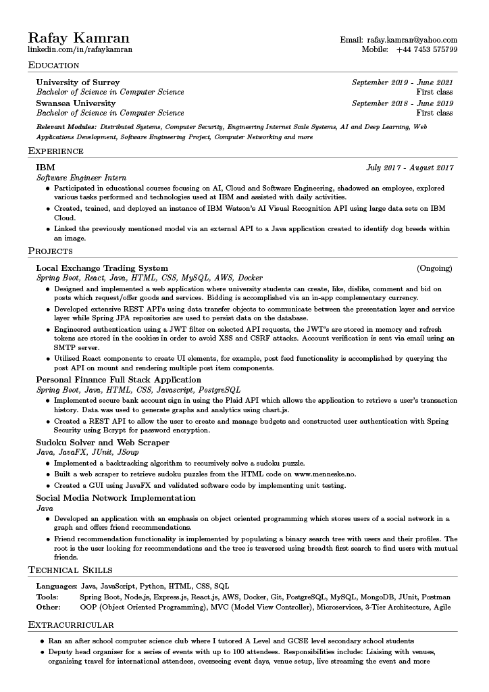

<h1 align="center">Hi 👋, I'm Rafay</h1>
<h5 align="center">I am a final year computer science student with internship experience at IBM</h5>

- 🔭 I’m currently working on a [Local Exchange Trading System](https://github.com/RafayKamran/LocalExchangeTradingSystem)
- 🌱 I’m currently learning **Spring Boot and React**

<h3 align="left">Languages and Tools:</h3>

             

    

<!--
### Hi there, my name is Rafay 👋

I am a final year computer science student at the University of Surrey with work experience at IBM.

- 🔭 I’m currently working on my Local Exchange Trading System
- 🌱 I’m currently learning Spring Boot and React

Languages:

Tools:

 -->

<!--
**RafayKamran/RafayKamran** is a ✨ _special_ ✨ repository because its `README.md` (this file) appears on your GitHub profile.

Here are some ideas to get you started:

- 🔭 I’m currently working on ...
- 🌱 I’m currently learning ...
- 👯 I’m looking to collaborate on ...
- 🤔 I’m looking for help with ...
- 💬 Ask me about ...
- 📫 How to reach me: ...
- 😄 Pronouns: ...
- ⚡ Fun fact: ...
-->
